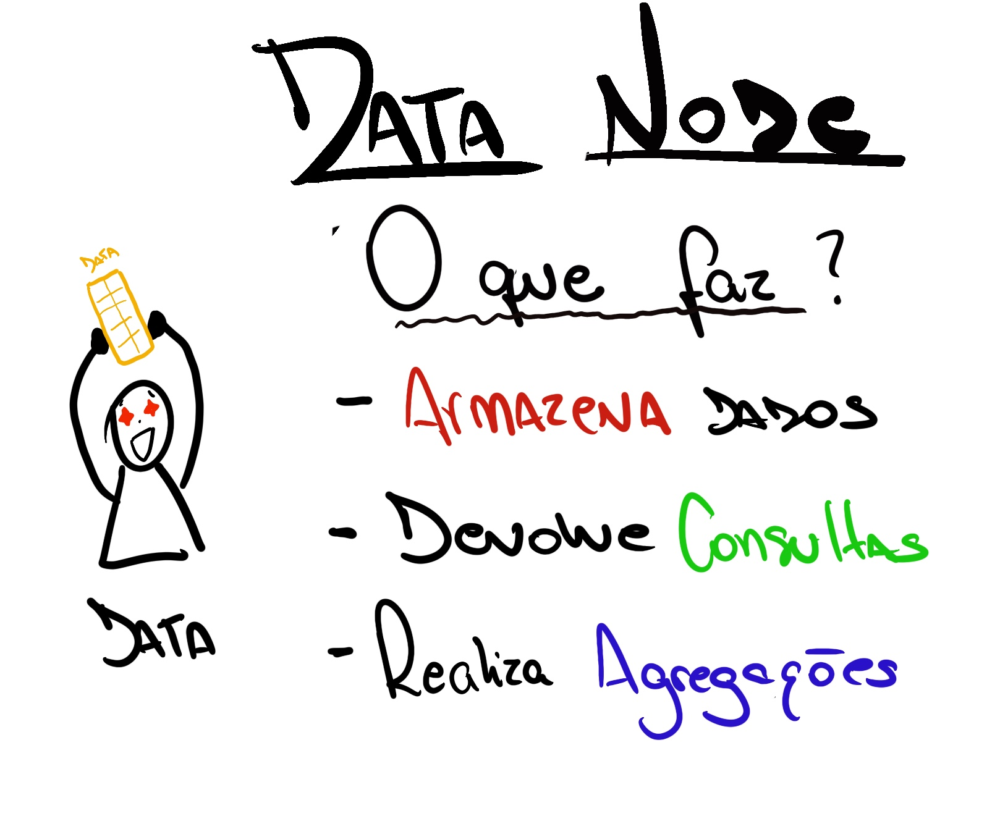
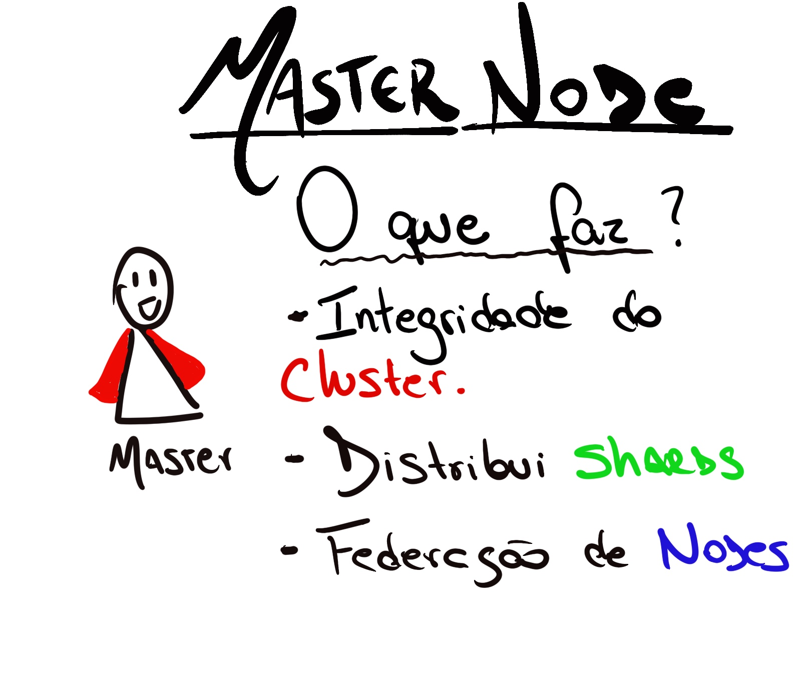
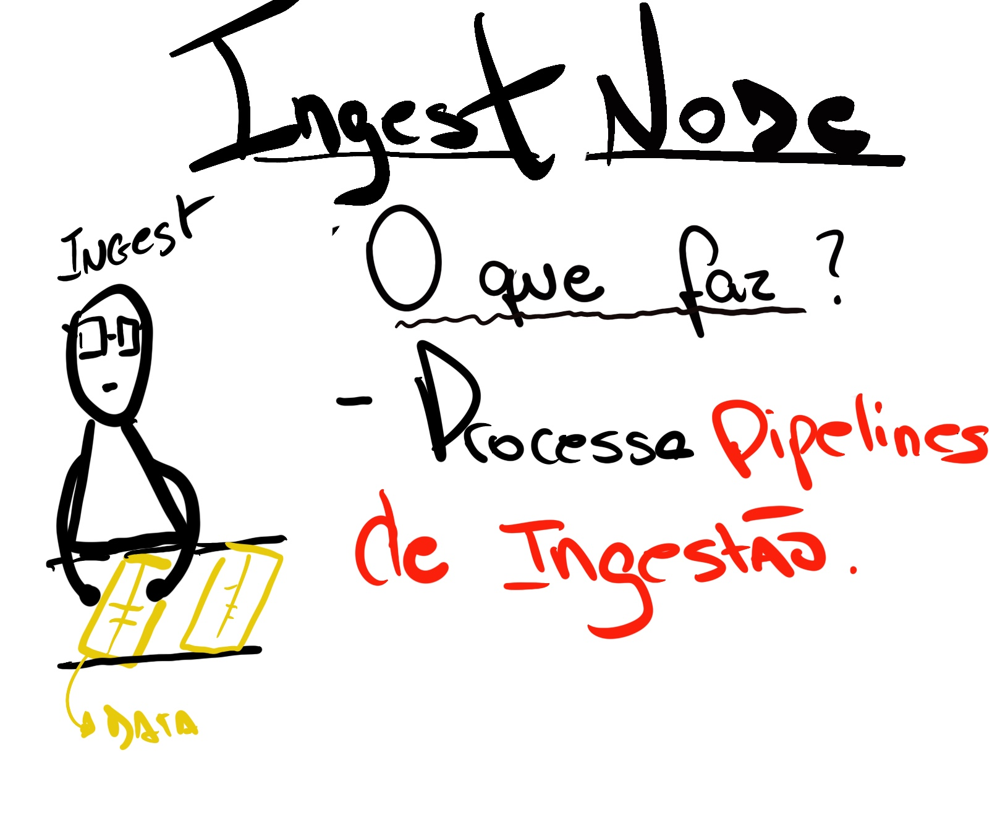
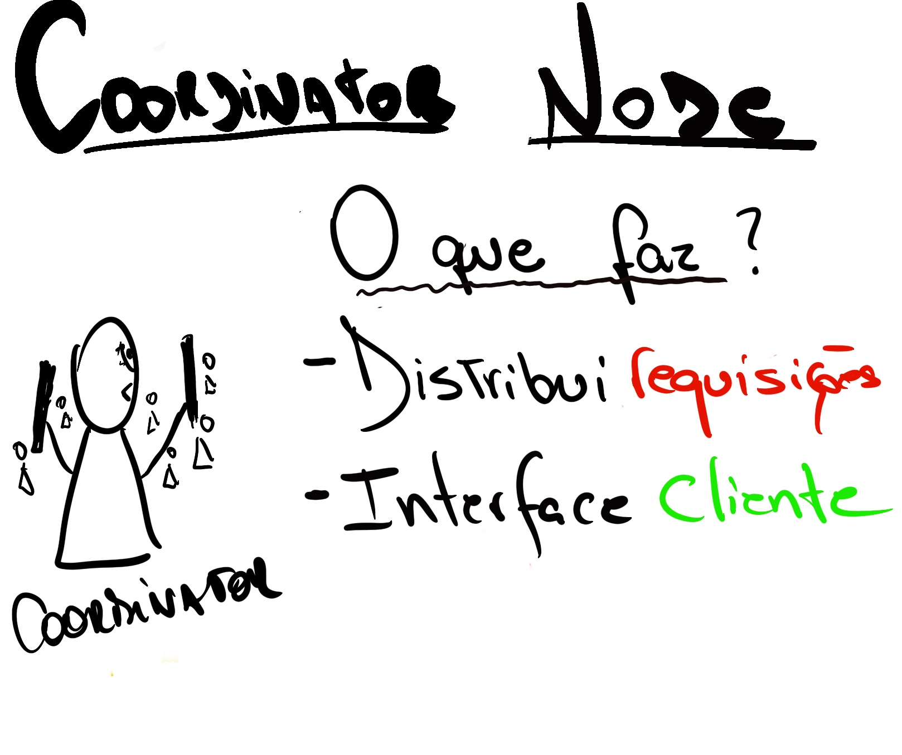
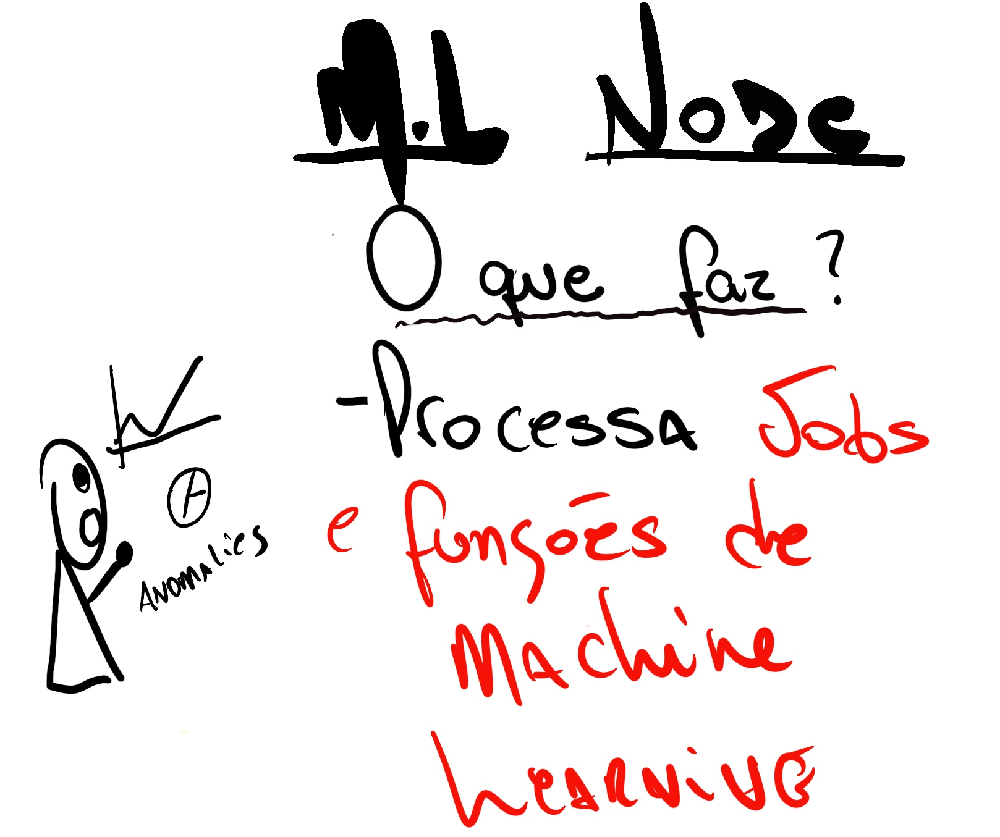

| [Home](https://techlipe.github.io/Workshop-Zero-To-Hero) | [Dia 01](https://techlipe.github.io/Workshop-Zero-To-Hero/dia01-configuracoes) | [Dia 02](https://techlipe.github.io/Workshop-Zero-To-Hero/dia02-observabilidade) | [Dia 03](https://techlipe.github.io/Workshop-Zero-To-Hero/dia03-elasticsearch) | [Dia 04](https://techlipe.github.io/Workshop-Zero-To-Hero/dia04-logstash) | [Dia 05](https://techlipe.github.io/Workshop-Zero-To-Hero/dia05-kibana) | 

# Workshop Elastic - Zero to Hero (Dia 3) - Elasticsearch
* **Criado por:** Felipe Queiroz <br>
* **Última atualização:** 05.04.2020


Fala pessoal! Sejam muito bem vindos ao nosso Dia 04 de Workshop de Zero to Hero com toda a Elastic Stack. Hoje vimos como funciona o Elasticsearch e pudemos entender como que trabalha o coração da Stack, o que são índices, documentos, mapeamentos dentre outros temas que são detalhados nesse documento. Espero que tenha gostado ;) 


# The Heart of the Stack: Elasticsearch
**Observação importante: Para seguir esse tutorial acessar Kibana > Dev Tools ;)**

**O que é um Nó e um Cluster Elasticsearch ?**

Nó é uma instância de Elasticsearch no ar, ou seja, quando incializamos o Elasticsearch (independente da maneira) temos um nó iniciado. Já um cluster também iniciado a partir de um nó, porém, um cluster pode ter múltiplos nós dentro deles, ou seja, um cluster também pode ser um agrupapemtno de nós de diversos papéis.

Se realizarmos uma chamada no contexto '/'
```
GET /
```

Teremos as informações gerais do nosso cluster, como o exemplo abaixo:
```
{
  "name" : "e3617abde627",
  "cluster_name" : "docker-cluster",
  "cluster_uuid" : "JnJggtUFR16lNwstxUfl1g",
  "version" : {
    "number" : "7.6.1",
    "build_flavor" : "default",
    "build_type" : "docker",
    "build_hash" : "aa751e09be0a5072e8570670309b1f12348f023b",
    "build_date" : "2020-02-29T00:15:25.529771Z",
    "build_snapshot" : false,
    "lucene_version" : "8.4.0",
    "minimum_wire_compatibility_version" : "6.8.0",
    "minimum_index_compatibility_version" : "6.0.0-beta1"
  },
  "tagline" : "You Know, for Search"
}
```

**Interfaces HTTP e Transport (TCP)**

O Elasticsearch trabalha com duas camadas de comunicação, uma HTTP REST para atender requisições client-side e outra TCP (Transport) que atende as demandas internas do cluster. Como vimos, a camada HTTP é onde o Kibana consome as informações do Elasticsearch e onde nós trabalharemos no nosso workshop, já a camada de transporte podemos imaginar um seguinte cenário.


## Tipos de Nós

---------------------------------------------------------------------------------------------------------------------------


---------------------------------------------------------------------------------------------------------------------------


---------------------------------------------------------------------------------------------------------------------------


---------------------------------------------------------------------------------------------------------------------------


---------------------------------------------------------------------------------------------------------------------------



## Indices
**Definição 1) Mapeamento e Schema-FREE**

Vamos indexar um documento em um índice chamado 'clientes':

```
PUT clientes/_doc/1
{
  "nome" :  "Felipe Queiroz",
  "rua"  : "Av. Brasil",
  "numero": "345",
  "idade" : "22"
} 
```
Agora vamos checar qual foi o mapeamento que o Elasticsearch gerou para nosso índice:
```
GET clientes/_mapping
```
 
Vamos observar através das buscas as diferenças entre keyword e text:
```
GET clientes/_search
{
  "query": {
    "match": {
      "nome": "Felipe"
    }
  }
}


GET clientes/_search
{
  "query": {
    "match": {
      "nome.keyword": "Felipe"
    }
  }
}
```

Criando um mapeamento prévio
```
DELETE clientes

PUT clientes/
{
  "mappings": {
    "properties": {
      "nome" : {
        "type" : "text",
        "fields": {
          "keyword" : {
            "type" : "keyword"
          }
        }
      },
      "rua" : {
        "type" : "keyword"
      },
      "numero" : {
        "type": "integer"
      },
      "idade" : {
        "type" : "integer"
      }
    }
  }
}
```
Inserindo o nosso documento novamente:
```
PUT clientes/_doc/1
{
  "nome" :  "Felipe Queiroz",
  "rua"  : "Av. Brasil",
  "numero": "345",
  "idade" : "22"
}
```
Observando os campos inteiros (que possuem aspas):
```
GET clientes/_search
{
  "aggs": {
    "maxidade": {
      "max": {
        "field": "idade"
      }
    }
  }
}
```

**Definição 2) Documentos**


A diferença entre PUT e POST se dá na geração do 'id' do documento, no primeiro cenário ele insere um numérico sequencial, já no segundo um hash. 

Exemplo PUT

Inserir um documento sem ID não é possível.
```
PUT nomes/_doc/
{
  "name" : "Felipe Queiroz"
}

```

Resultado Esperado:
```
{
  "error" : "Incorrect HTTP method for uri [/nomes/_doc/?pretty=true] and method [PUT], allowed: [POST]",
  "status" : 405
}
```

Colocando um ID no documento temos um resultado OK:

```
PUT nomes/_doc/1
{
  "name" : "Felipe Queiroz"
}

RESULTADO:
{
  "_index" : "nomes",
  "_type" : "_doc",
  "_id" : "1",
  "_version" : 1,
  "result" : "created",
  "_shards" : {
    "total" : 2,
    "successful" : 1,
    "failed" : 0
  },
  "_seq_no" : 0,
  "_primary_term" : 1
}
```

A inserção com POST sem id ficaria:

```
POST nomes/_doc/
{
  "name" : "Felipe Queiroz"
}
```


**Configurações de ìndices**

```
GET clientes/_settings
```

Vamos aumentar o número de replicas

```
PUT clientes/_settings
{
  "number_of_replicas" : 3
}
```

Caso quisessemos alterar as configurações do nosso índice 'clientes' desde o ínicio teriamos algo como abaixo:
```
PUT clientes/
{
  "settings": {
    "number_of_shards": 2,
    "number_of_replicas": 2
  }, 
  "mappings": {
    "properties": {
      "nome" : {
        "type" : "text",
        "fields": {
          "keyword" : {
            "type" : "keyword"
          }
        }
      },
      "rua" : {
        "type" : "keyword"
      },
      "numero" : {
        "type": "integer"
      },
      "idade" : {
        "type" : "integer"
      }
    }
  }
}
```

## API's
**cat API**

Essa API tem a função de apresentar alguma informação de maneira mais "human-readable" possível.

Exemplos:
Nós dentro do cluster:
```
GET _cat/nodes?v
```
Alocação de shards:
```
GET_c at/allocation
```
Tarefas executando no cluster:
```
GET _cat/tasks
```

**cluster/health**

Responsável por apresentar com detalhes a saúde atual do cluster.

```
GET _cluster/health
```

Obs: 
Saúde Yellow = Existem shards replicas que não foram indexadas.
Saúde Red = Existem shards primárias que não foram indexadas

Para conferir os impedimentos de alocação use a API abaixo:

```
GET _cluster/allocation/explain
```

**bulk/**

Para não gastarmos recursos computacionais indexando documentos 1 a 1, podemos utilizar a API de bulk para indexar vários documentos de uma única vez.

Exemplo:
```
POST _bulk
{ "index" : { "_index" : "clientes", "_id" : "1" } }
{ "nome" : "Felipe Queiroz" }
{ "create" : { "_index" : "clientes", "_id" : "2" } }
{ "nome" : "Anselmo Borges" }
{ "create" : { "_index" : "clientes", "_id" : "3" } }
{ "nome" : "Priscilla Parodi" }
```

## Breve Apresentação a Buscas

Antes de iniciarmos, "bulkar" os documentos abaixo para fazermos experimentos com as buscas.

```
POST _bulk
{ "index" : { "_index" : "clientes_buscas", "_id" : "1" } }
{ "nome" : "Antonio" , "idade" : 20}
{ "create" : { "_index" : "clientes_buscas", "_id" : "2" } }
{ "nome" : "Guilherme" , "idade" : 40}
{ "create" : { "_index" : "clientes_buscas", "_id" : "3" } }
{ "nome" : "Gabriel" , "idade" : 24}
{ "create" : { "_index" : "clientes_buscas", "_id" : "4" } }
{ "nome" : "Bruna" , "idade" : 32}
{ "create" : { "_index" : "clientes_buscas", "_id" : "5" } }
{ "nome" : "Daniela", "idade": 19 }
{ "create" : { "_index" : "clientes_buscas", "_id" : "6" } }
{ "nome" : "Guilherme" , "idade" : 23}
```

Vamos buscar os documentos que possuem o campo 'nome' o valor 'Guilherme':

```
GET clientes_buscas/_search
{
  "query": {
    "match": {
      "nome": "Guilherme"
    }
  }
}
```

Agora vamos buscar por clientes que estão na faixa de idade entre 20 e 29 anos.

```
GET clientes_buscas/_search
{
  "query": {
    "range": {
      "idade": {
        "gte": 20,
        "lte": 29
      }
    }
  }
}
```


